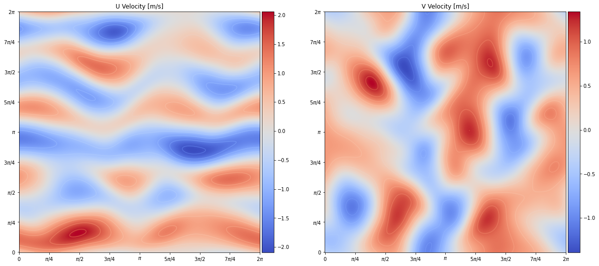

# KolSol

KolSol is a pseudospectral Kolmogorov flow solver, using the a Fourier-Galerkin approach as described by Canuto [[1]](#R1). This library contains both `NumPy` and `PyTorch` implementations to allow for autograd-compatible workflows. Please note that the implementation of the FFT within `NumPy` is much more efficient so for general usage this version is preferable.

The solver provides numerical solutions to the divergence-free Navier-Stokes equations:

<p align='center'>

</p>

As a spectral method is employed, using a larger quantity of wavenumbers will reduce the numerical error.
<br>**Note:** Highly accurate simulations can be attained even with relatively few wavenumbers.

## **Flowfield:**
<p align='center'>

</p>

## **Installation:**
To install KolSol, please clone the repository and then run the following command:

```shell
$ python setup.py install
```

## **Solver Example:**

```python
import numpy as np
from kolsol.numpy.solver import KolSol

# instantiate solver
ks = KolSol(nk=8, nf=4, re=30.0, ndim=2)

# define initial conditions
u_hat = ks.random_field(1.0, 0.001, [0, 3])

# run simulation
for t in np.arange(0.0, 10.0, 0.01):
  u_hat += dt * ks.dynamics(u_hat)
```

## **References:**
<a id="R1">**[1]**</a> Canuto, C. (1988) Spectral methods in fluid dynamics. New York: Springer-Verlag.

